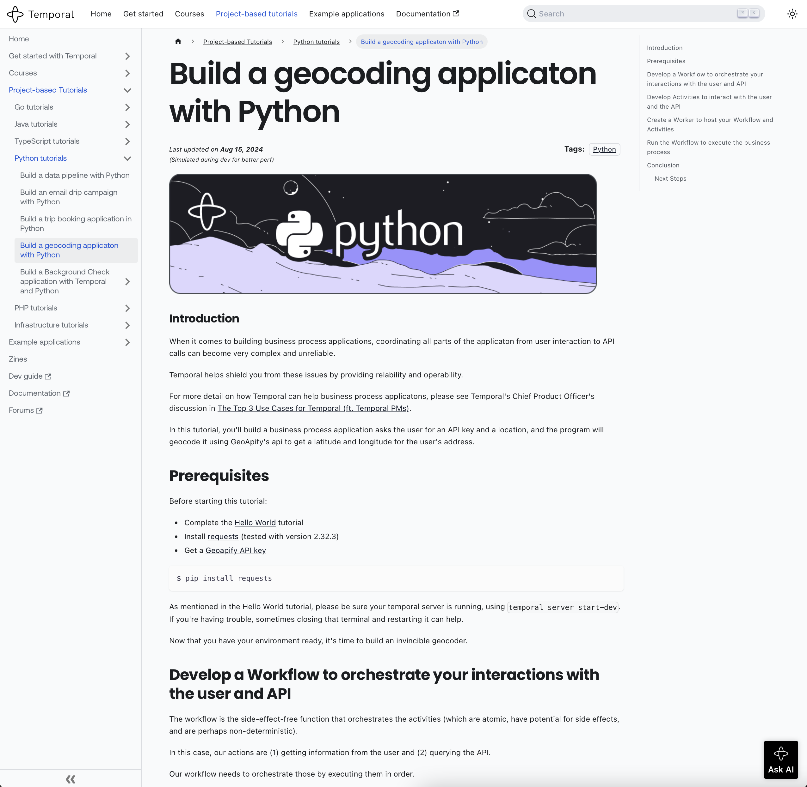

# Building a Geocoding Application with Temporal and Python

This is a tutorial to display some of Temporal's functionality.
Specifically it is a business process application, and it is part of the Python Project-Based Tutorial Series.
In this series, each tutorial has a repository that holds the code ([ex1](https://github.com/temporalio/data-pipeline-project-python), [ex2](https://github.com/temporalio/email-subscription-project-python)) and a [narrative tutorial that goes with the code](https://learn.temporal.io/tutorials/python/).

This tutorial's narrative is [here](https://learn.temporal.io/tutorials/python/build-a-geocoding-application/) and looks like this:

